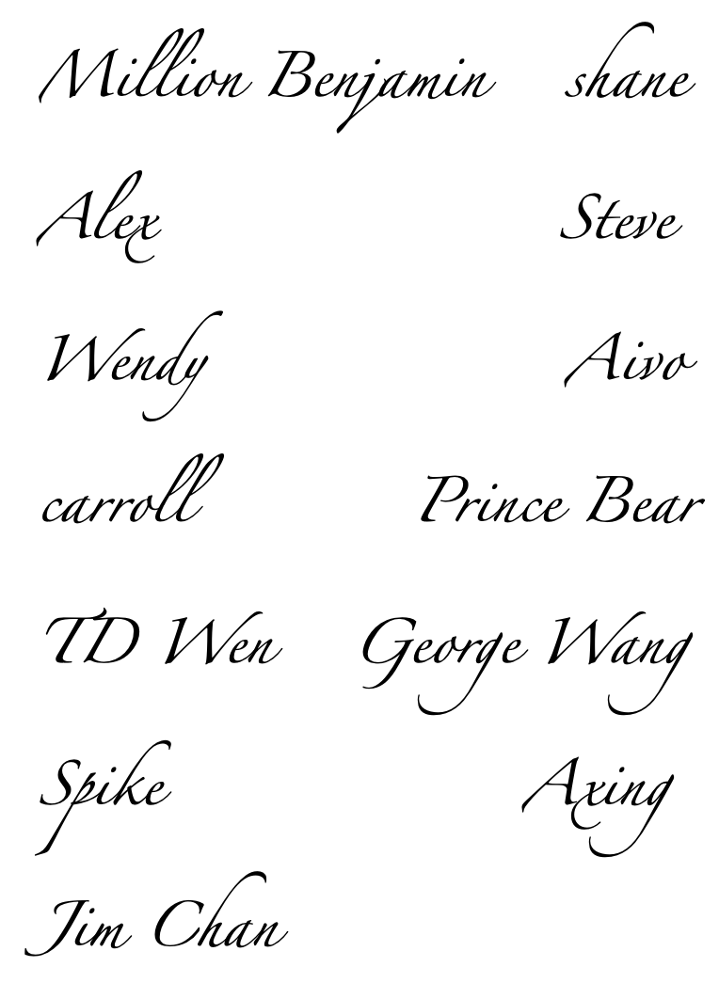

# Ultimate Project – The Ultimate Tool for PM 项目章程

> Proudly Presented by Invincible Inc.

*Ultimate Project将会是项目管理工具的终极解决方案，它拥有当前所有项目管理软件的主流功能，成为项目管理软件的集大成者，并在此基础上增加能提升项目管理效率的功能/组件，让用户做出极致的项目管理工作。*

______

**项目名称**：Ultimate Project – The Ultimate Tool for PM

**授权日期**：5月1日

**项目开始日期**：6月1日 
           
**项目结束日期**：9月1日前发布第一个正式版本，11月15日前发布第二个正式版本，而后长期迭代

______

**关键日期里程碑**：
- 6月1日项目正式开始前，组建项目团队，团队应包括管理岗人才、技术岗人才和质量岗人才，其中技术岗人才可以兼任其他两种类型的人才。同时还要确认外部顾问人选，可以是学院老师、企业从业人员。
- 6月15日前，总结现有项目管理软件的主流功能，并在团队内部头脑风暴讨论出至少三个可以额外添加的、能提升项目管理效率的功能组件，总结成需求文档。
- 8月15日前，完成初版应用（软件原型）开发，经过质量岗测试后，交由团队内部的管理岗进行使用体验，内部总结出改进方案。
- 9月1日前，根据内部总结的方案对初版应用进行改进，9月1日发布第一个正式版本供用户使用。
- 11月15日前，对第一版软件用户进行问卷调查，根据用户的体验情况，以及用户期望的新功能，对软件进行迭代改良。11月15日发布第二个正式版本供用户使用，而后进入长期迭代过程。

------

**预算**：该项目预算为80万元人民币，可能会根据需要增资。项目主要成本为内部开发团队和外部顾问的人工费用。服务器、开发用计算机等硬件以及网络服务优先使用学院现有的设备与服务，但仍有可能需要额外购买设备或服务。

------

**项目负责人**：Million Benjamin, millionbenjamin@qq.com

------

**项目目标**：打造一款极致、前卫的项目管理软件。在软件第二个正式版本发布后的五年内，保证市场占有率年均增长10%。

------

**项目成功主要标准**：软件完整地实现预期功能，各项功能与预期功能说明一致，并通过全面测试，准时完成。第二个正式版本发布后用户反馈良好。

------

**方法**：
- 尽快组建团队并寻找顾问，可在学院内发布通知招募。
- 项目正式开始半个月内，制作工作分解结构（WBS），范围描述和甘特图，详细说明完成一款项目管理软件、实现预期各项功能需要做的工作。
- 硬件、网络服务、开发工具等优先使用学院现有的软硬件和服务。
- 项目团队每周召开进度审核会，每两周邀请顾问参与进度审核会。
- 根据批准的测试计划全面测试项目功能。

------

**项目角色及职责**：

| 昵称             	| Github                                 	| 邮箱                    	| 岗位角色                 	| 分工内容                                                                                   	|
|--------------------	|------------------------------------------	|---------------------------	|----------------------------	|----------------------------------------------------------------------------------------------	|
| Million Benjamin 	| [MIllionBenjamin](https://github.com/MIllionBenjamin)     	| millionbenjamin@qq.com  	| 项目负责人、Python工程师 	| 使用Flask/Django框架进行后端搭建                                                           	|
| shane            	| [shanechick](shanechick.github.com)                  	| 975696555@qq.com        	| 项目经理或者客户经理     	| 分解需求和做PPT                                                                            	|
| Alex             	| [zhangjw83](https://github.com/zhangjw83)           	| 819703057@qq.com        	| 产品经理，UI/UX设计师    	| 前端开发，产品规划                                                                         	|
| Steve            	| [dongzizhu](https://github.com/dongzizhu)           	| guzsh@mail2.sysu.edu.cn 	| 产品经理，DevOps工程师   	| 需求说明，运营反馈                                                                         	|
| Wendy            	| [Choitempo](https://github.com/Choitempo)           	| 578617297@qq.com        	| 客户经理                 	| 需求调研等                                                                                 	|
| Aivo             	| [Aivo520](https://github.com/Aivo520)             	| 1730174410@qq.com       	| 产品经理，数据库DBA      	| 后台开发                                                                                   	|
| carroll          	| [SantanderAuhAuh](https://github.com/SantanderAuhAuh)     	| 18395595489@163.com     	| js工程师                 	| 前端开发                                                                                   	|
| Prince Bear      	| [wzx971127](https://github.com/wzx971127)           	| 673730136@qq.com        	| 项目经理，Java工程师     	| 移动端开发（Android）                                                                      	|
| TD Wen           	| [desperateofstruggle](https://github.com/desperateofstruggle) 	| 1421166369@qq.com       	| 数据库DBA                	| 数据库管理监控升级调优等因上一题注明只能选一项技术岗，此处补充可java工程师——模块功能研发等 	|
| George Wang      	| [farthjun](https://github.com/farthjun)            	| 13539062145@163.com     	| 客户经理、数据库DBA      	| 客户经理：客户访问&需求调查、客户分析与分类or数据库DBA：设计、安装、监控数据库             	|
| Spike            	| [yaorangtayi](https://github.com/yaorangtayi)         	| 1033720276@qq.com       	| UI/UX设计师              	| 更喜欢搞UI这些                                                                             	|
| Axing            	| [xy1998921](https://github.com/xy1998921)           	| 312618502@qq.com        	| 产品经理                 	| 线框图，原型设计                                                                           	|
| Jim Chan         	| [ChanKimFung](https://github.com/ChanKimFung)         	| 543600432@qq.com        	| 客户经理，产品经理        	| 因为代码能力非常非常薄弱，可能只能负责一些管理岗位，或者优化界面一类的工作                 	|

------

**签署人**：（上述全部利益相关者签名）

------

**个人宣言**：（由上述利益相关者手写或打印）

Million Benjamin:	

*“作为项目组的组长、项目的负责人，我会统筹好各项工作，合理分配任务，参与验证阶段性成果。并且我也会为项目搭建可靠的后端。希望与大家一同努力，做好Easy Project--最好的项目管理软件！”*

George Wang:

*“我会做好客户访问，仔细识别潜在客户，管理好与现有客户的关系，与大家一起努力将项目管理软件推向世界！我也会做好数据库管理，为我们的项目管理软件打下坚固的基石！”*

Prince Bear:

*“最近在自学Android软件开发，如果项目有Android移动端的开发，希望可以活学活用，当然也服从安排，大局为主。”*

TD Wen:

*“我会努力做好本职工作，期待与大家一道努力，做出最好最前卫的项目管理软件！”*

Spike:

*“我会尽力做好自己的工作，大家一起努力，冲冲冲！”*

Axing:

*“我会努力做好产品的原型设计，与大家一起努力做出咱们最好的项目管理软件！”*

Jim Chan:

*“我会尽我所能和大家一起努力！做出一款大家都满意最好最棒的项目管理软件！”*

shane:

*“我希望努力做好自己本职工作，尽量不拖大家后腿。”*

Alex:

*“在团队中希望做好前端开发，努力做出最好最前卫的项目管理软件。”*

Steve:

*“希望我们能完成一个可以放上简历的作品。”*

Wendy:

*“我会努力做好需求调研，与大家积极沟通，更高效的完成我们的项目。”*

Aivo:

*“冲冲冲！”*

carroll:

*“我会做好前端开发。”*

------
