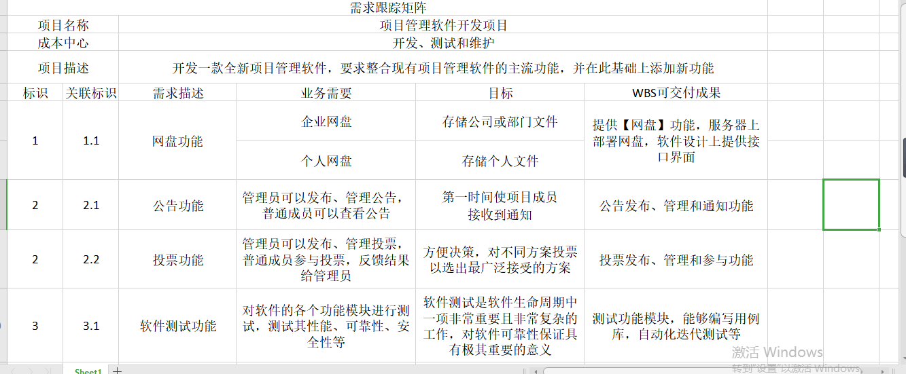

# 需求-2020.06.16

> 我们的项目要整合现有主流功能，并在此基础上添加新功能。所以需求是：1. 现有的项目管理软件主流功能；2. 新功能。这两点可以从我们上一次[团队作业](https://invincible-inc.github.io/Second-Ordinary-Work/Products/business_case)中的**产品对比分析**和**未来产品功能扩展**中 总结得到。此外还可以简要叙述一下项目需要的硬件/设备需求（如PC、服务器）和场地需求。

## 资源需求

硬件设备需求：12台PC，2台服务器
场地需求：办公场地、服务器室
资金需求：100000人民币

## 功能需求

### 新功能1：通过网盘管理文件

文件是企业非常重要的知识资产，日常工作中产生的文件有些是临时性文件而有的却是企业需要长期留存的重要文件。通过新增【网盘】功能提供无限存储空间，满足企业存储、版本管理、协作等需求。网盘提供企业网盘和个人网盘两种存储形式，企业网盘主要存储公司或部门文件，需要与其他成员分享或协作，个人网盘存储个人文件。企业网盘中文件的存储范围有两种：公开和私有，分别对应不同的权限。

公开网盘顾名思义就是全员公开，大家都可以看到的网盘，可以用于存储公司制度、企业文化等相关资料

私有网盘中的资料只有加入的成员才可以看到，另外，还可以对每个成员的权限进行设置，针对不同成员分别设置编辑、上传、下载、只读等权限，保障数据安全性；

除了以上四种权限外，还可以在企业后台自定义网盘权限：

### 新功能2：公告与投票

公司各类通知公布与意见的收集是企业与员工交流的窗口，也是企业文化的一部分。Worktile提供【公告】和【投票】两个应用分别满足企业不同需求。 公告主要用于公布各类通知，投票则用于各类意见的收集。

发布公告：通知基本分类完成后就可以在企业内部发布公告，公告发布需要填写公告标题、类型、内容等，由于各通知的类型不同，所以在发布公告时，可针对不同的通知类型选择公告范围，避免非相关成员收到与自己无关的通知而造成打扰；除此之外，还可以上传附件，选择是否需要置顶这条公告及是否需要回执等。

公告管理 除了发布公告，所有成员都可以在公告下查看接收的所有公告、需要发送回执的公告及自己发布的公告。

发布投票 发布投票时，要确定投票主题（即标题）、投票范围（需要收集哪些人的意见）、投票方式（实名还是匿名及截止到什么时间）、投票结果查看范围（只需要知晓最终结果还是需要知道每个人投了哪一项等），然后对此次投票做一个简单说明，最后设置投票问题。

投票管理 在投票中可以查看全部投票、所有由“我”参与的投票和发起的投票。

### 新功能3：测试功能

软件测试是软件生命周期中一项非常重要且非常复杂的工作，对软件可靠性保证具有极其重要的意义。我们可以新增测试功能，对软件的各个功能模块进行测试，测试其性能、可靠性、安全性等。

测试团队都会维护许许多多的用例，创建用例库，并在组织库中编写用例。

进入具体测试计划中，可选择未开始、进行中、已完成三种状态进行状态的更改。

将构建过程中的自动化测试结果传送到迭代中，让项目成员能够快速直观地看到自动化测试的结果。

# 需求矩阵

新功能：

