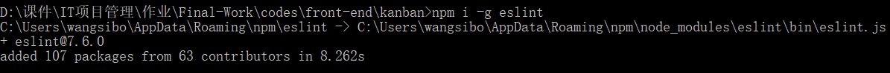
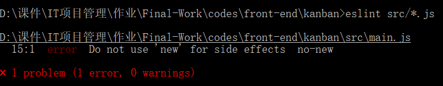
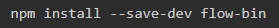
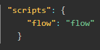
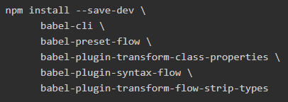
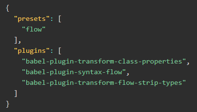
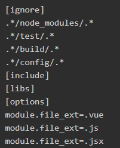
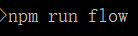

# 静态代码分析

## 后端Python代码

**使用Python静态代码分析工具flake8进行后端代码静态测试(flake8版本3.8.3)。**

flake8基础错误返回码一共有以下三种：

- 以E/W开头：PEP8中的error和warning
- 以F开头：通过PyFlakes检测出的error
- 以C9开头：通过McCabe检测出的代码复杂度

测试codes/Backend/KanbanDBManager.py (忽略错误码E501：行太长错误):

```
flake8 –ignore E501 KanbanDBManager.py
```

测试结果：


测试codes/Backend/Kanban_api.py (忽略错误码E501：行太长错误):

```
flake8 –ignore E501 Kanban_api.py
```

测试结果：


出现的错误/警告都是因为代码没有按照PEP8代码风格编写，并没有其他形式的错误。

## 前端Javascript代码

Vue-cli自带ESLint代码检测插件，用于规范代码风格

安装



运行



有一个小错误，可忽略（加上/* eslint-disable no-new */注释）


使用Flow可以进行静态类型检查

安装



在package.json中加入下面的脚本



同时还要安装babel编译器，将flow的类型检查代码从代码中剥离



在babel配置文件.babelrc中加入



初始化


在 .flowconfig 中加入一些配置（忽略某些文件）



在需要检测的文件加入注释`//@flow`或者`/*@flow*/`

运行



未发现错误，可以正常运行