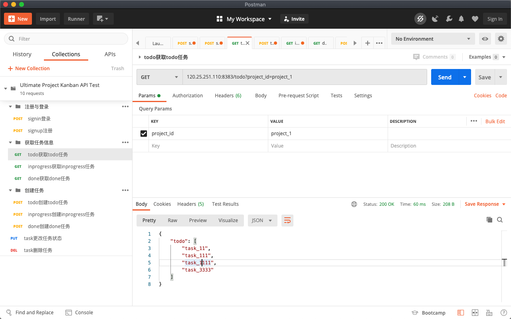

# 后端Python代码单元与集成测试、测试用例

- [后端Python代码单元与集成测试、测试用例](#后端python代码单元与集成测试测试用例)
  - [数据库连接测试](#数据库连接测试)
  - [数据库交互功能测试](#数据库交互功能测试)
  - [API使用测试](#api使用测试)

## 数据库连接测试

[codes/Backend/test_db_connect.py](../../codes/Backend/test_db_connect.py)

```python
import pymysql

'''
mysql -u root -p'123456' -h 120.25.251.110 -P 3306 -D schema_pm
'''

db_config = {
    "host": "120.25.251.110", 
    "port": 3306, 
    "user": "root", 
    "password": "123456", 
    "database": "schema_pm"
}

db_connection = pymysql.connect(host = db_config["host"], 
                                port = db_config["port"], 
                                user = db_config["user"], 
                                password = db_config["password"], 
                                database = db_config["database"])

db_connection.close()
```

测试结果正常

## 数据库交互功能测试

[codes/Backend/test_KanbanDBManager.py](../../codes/Backend/test_KanbanDBManager.py)

```python
from KanbanDBManager import KanbanDBManager

test = KanbanDBManager({
    "host": "120.25.251.110", 
    "port": 3306, 
    "user": "root", 
    "password": "123456", 
    "database": "schema_pm"
})

test.sign_up_project("project_1", "1")
print(test.sign_in_project("project_12", "123456"))
print(test.sign_up_project("project_2", "123456"))
print(test.get_todo_task("project_1"))
print(test.get_inprogress_task("project_1"))
print(test.get_done_task("project_1"))
print(test.create_todo_task("project_1", "task_111"))
print(test.create_inprogress_task("project_1", "task_222"))
print(test.create_done_task("project_1", "task_333"))
print(test.change_task_status("project_1", "teask_23", 3))
print("END")
```

测试结果正常

```
KanbanDBManager-root-120.25.251.110-schema_pm
Log File: KanbanDBManager-root-120.25.251.110-schema_pm.log
False
False
['task_11', 'task_111', 'task_1111', 'task_3333']
['task_2', 'task_22', 'task_222', 'task_2222']
['task_23', 'task_3', 'task_33', 'task_333', 'task_33333']
False
False
False
True
END
```

## API使用测试

接口文档见：[https://www.showdoc.cc/959673659467626?page_id=5013943838503875ht](https://www.showdoc.cc/959673659467626?page_id=5013943838503875)

要查看API使用测试，将[codes/Backend/Ultimate Project Kanban API Test.postman_collection.json](../../codes/Backend/Ultimate%20Project%20Kanban%20API%20Test.postman_collection.json) 导入（import）到[Postman](https://www.postman.com/downloads/)中即可。

API测试截图示例：


